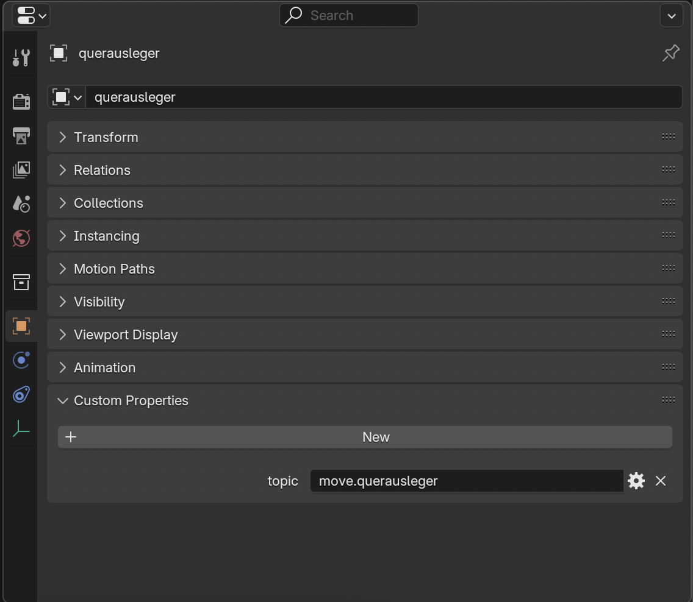
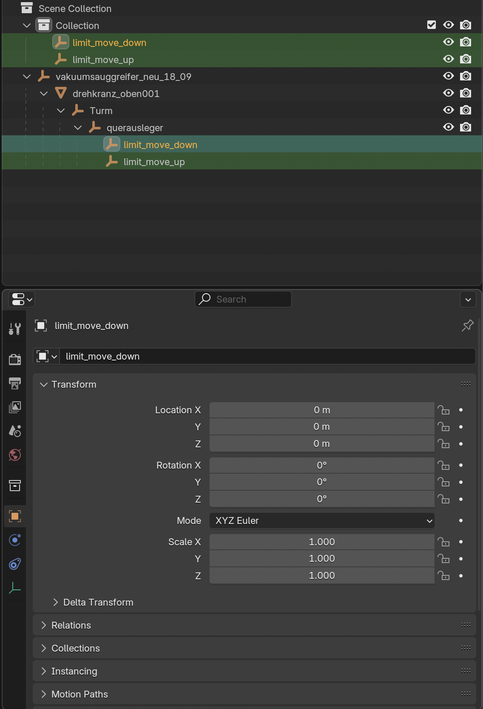
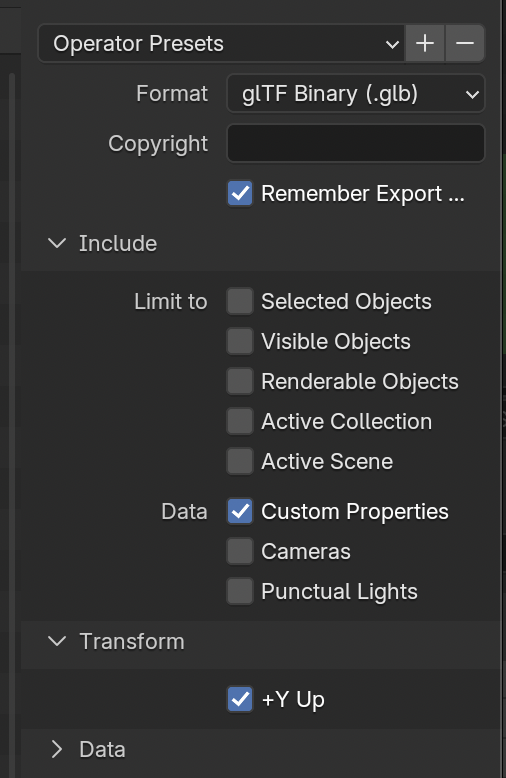

# Creating Models

# Conversion

KeepMeAlive3D currently only works with .GLB files.
Since not every model is available in this format, a conversion may be necessary.
While Blender supports many import formats, not all are covered.
If you need to convert a .STEP file, you can use the FreeCAD application.

# Blender

To use the full potential of the application, the models need to be annotated with custom annotations.
The following is a step-by-step guide on how to do this.

## Topics

In order to display the data graphs of parts, components in the sidebar, and animations, the appropriate MQTT topics are
required.

1) Select the component in Blender by clicking on it.
2) In the sidebar select the object properties icon (orange square).
3) Open the dropdown 'Custom Properties'.
4) Click new and add the name in following format:
    * If the object has moving animations use the prefix 'move.' and append the object name.
    * If the object has rotation animations do the same with the prefix 'rot.'
    * If there are no animations: use the normal topic.

The result should look like in the image below:

## Animations

To add animations the step 'Topics' is required first. Then proceed as follows:
Do the following steps two times:

1) In Blender click 'Layout', 'Add', 'Empty', 'Sphere'. Adjust the radius of the sphere as needed.
2) Name the first empty 'limit_move_up' and the second 'limit_move_down'.
3) Select one and the object that will have the animations in the end.
    * Press Command + P and select the option 'Object (Without Inverse)'.
      This will make the empty a child and move it to the position of the parent. The relative coordinates will be 0.

4) Now the empties can be moved to represent the upper and lower bounds of the object's animation.
   See the example below where the bounds for the cross arm (querausleger) are visible.

The same can be done with rotated empties for the rotation bounds.
Name these 'limit_rot_max' and 'limit_rot_min'.
However, currently an object can only have one pair of empties, so it can have either rotations or moving animations.

## Export

When exporting the model from Blender, make sure the following options are selected:

# Import

The model can be imported in the KeepMeAlive3D UI on 'Model', 'Upload'.